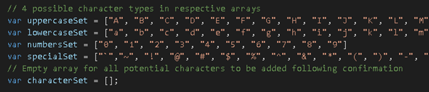
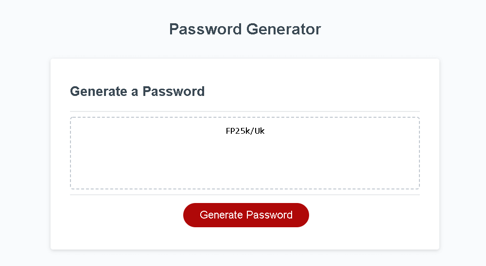

# password-generator

A Web Application which generates random passwords according to user criteria

Developed by Skyler Blakeslee

- URL: https://skyler-blakeslee.github.io/password-generator/
- Git Repository: https://github.com/skyler-blakeslee/password-generator

## Table of Contents
- [Functionality](#functionality)
- [Modifications](#modifications)
- [Screenshots](#screenshots)

## Functionality

Using javascript, this site generates and displays a random password according to user criteria confirmed through a series of prompts.

The user is first asked to choose a length between 8 and 128 characters, Then asked if they wish to conclude uppercase letters, lowercase letters, numbers, or special characters. Individual arrays for each character type are concatenated to "characterSet" according to user preference. 

The desired number of characters are then randomly selected from this combined array and joined to form the password which is displayed in the text area.

## Modifications

- add functionality allowing specific special characters to be included or excluded as desired
- incorporate technology allowing for more complete randomization
- improve UI

## Screenshots

### Home Page
